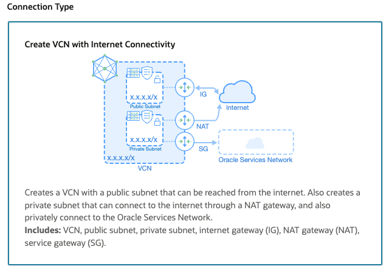
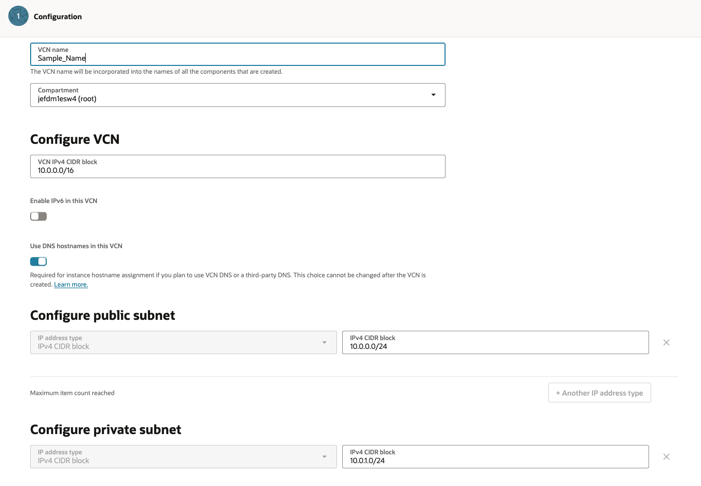
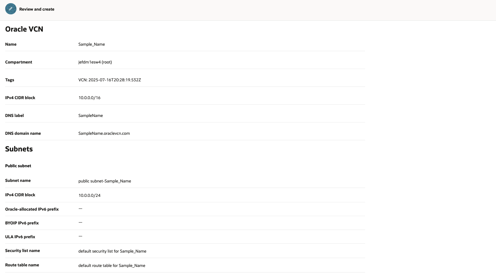
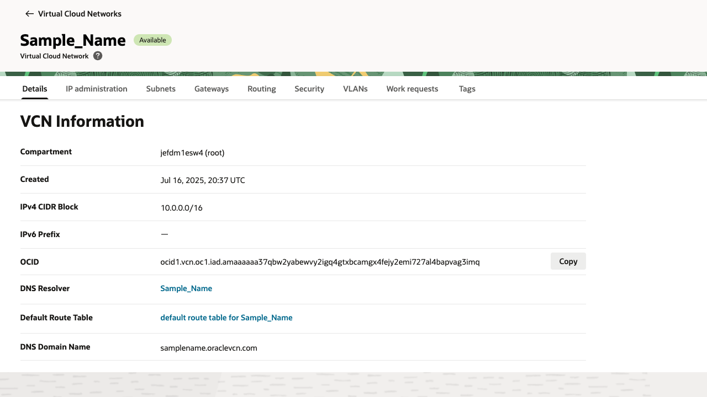

# Setup the custom VCN and the compute instance

## Introduction

Oracle Cloud Infrastructure (OCI) Compute lets you create multiple Virtual Cloud Networks (VCNs). The closest comparison to a VCN in the physical world is a Data Center. It can contain storage, routers, load balancers, subnets, firewalls, servers and many other types of network assets.

Be sure to review [Overview of Networking](https://docs.cloud.oracle.com/iaas/Content/Network/Concepts/overview.htm) to gain a full understanding of the network components.

Estimated Time: 20 minutes

### Objectives
In this lab, you will:
- Create a virtual cloud network 
- Create a compute instance inside of that VCN

## Task 1: Sign in to OCI Console and Create VCN

1. From the OCI Services menu, click **Networking** > **Virtual Cloud Networks**. 

   
    
<!--
1. Look the lower right corner of your screen for a slider selection titled "Redwood Preview".
**DISABLE** Redwood Preview. This entire lab assumes you are not using the Redwood Preview.  

    
-->

1. Just above the Actions menu, the current compartment will be displayed. Make certain you are in the desired compartment (learn more about compartments here: https://docs.public.content.oci.oraclecloud.com/en-us/iaas/Content/Identity/compartments/Working_with_Compartments.htm).  

   Select the Actions Menu and select **Start VCN Wizard**.

  

1. Click **Create VCN with Internet Connectivity** and click **Start VCN Wizard**.

    

1. Fill out the dialog boxes:

      - **VCN NAME**: Provide a name of your choosing (ex *Inference-VCN*)
      - **COMPARTMENT**: Ensure your compartment is selected. If you have not defined a compartment, use the default.
      - **VCN CIDR BLOCK**: Use the Default (10.0.0.0/16)
      - **PUBLIC SUBNET CIDR BLOCK**: Use the Default (10.0.0.0/24)
      - **PRIVATE SUBNET CIDR BLOCK**: Use the Default (10.0.1.0/24)
      - Click **Next**

    
    

1. Verify that all the information is correct and  click **Create**.

    

    This will create a VCN with the following components.

    *VCN, Public subnet, Private subnet, Internet gateway (IG), NAT gateway (NAT), Service gateway (SG)*

1. Click **View Virtual Cloud Network** to display your VCN details.

    

## Task 2: Create a compute instance

1. Go to the OCI console. From the OCI services menu, click **Compute** > **Instances**.

    

1. Click **Create Instance**. 

    

1. Enter a name for your instance and select the compartment you used earlier to create your VCN.

             

1. Scroll down on the page. Click **Change Image**

1. Match the selections seen in the image below to the **Select an Image** dialog on your screen:
    - **Image:** Ubuntu (as seen in the image above)
    - **Image Name:** Select Canonical Ubuntu 24.04
    - **Image Build:** Select the default

    

1. Scroll down on the page. Click **Change Shape**.

   
1. In the **Browse All Shapes** dialog:

      - **Instance Type**: Select Bare Metal machine
      - **Shape Series**: Specialty and previous generation
      - **Instance Shape**: Select any BM.GPU.x shape except for BM.GPU.MI300X.8 as this lab is written for NVIDIA libraries.  
      **Important**: **You can also use a Virtual Machine of type VM.GPU.A10.x and it will be faster.**
      If you do not have BM.GPU or VM.GPU.A10 shapes in your tenancy, you can still run the model using CPU only and the lab will call that out at the proper step.
      Pro Tip: If a shape is greyed out, cancel this dialog and select a different AD where the shape may be available. 

      
      

      Click **Select Shape** (scroll down to first Check the required T&C box).

1. Scroll down to **Primary VNIC Information** section and edit the following:

      - **Virtual cloud network**: Choose the VCN you created in Task 1
      - **Subnet:** Choose the **Public Subnet** under Public Subnets (it should be named Public Subnet-NameOfVCN)
      - **Assign a public IPv4 address**: Verify this option is selected

       

      Click Next to progress the wizard to the Security section. Make no changes and click Next again to progress to the Networking section.
      - **Add SSH Keys:** Choose **Generate a key pair for me** and save private and public keys. If you already have ssh keys, choose **Paste public keys** or upload it here.
      
      
      
         

      Click Next one more time to progress to the Review section.  

1. Click **Create**.

1.  Wait for the instance to have the **Running** status. Note down the Public IP of the instance. You will need this later.
    

T minus 4...  

*Congratulations! You have successfully completed this lab.* 
You may now **proceed to the next lab**.

## Acknowledgements
* **Author** - Jeff Allen, Distinguished Cloud Architect, AI Accounts
* **Contributors** -  Animesh Sahay, Enterprise Cloud Engineering
* **Last Updated:** - May 2025
